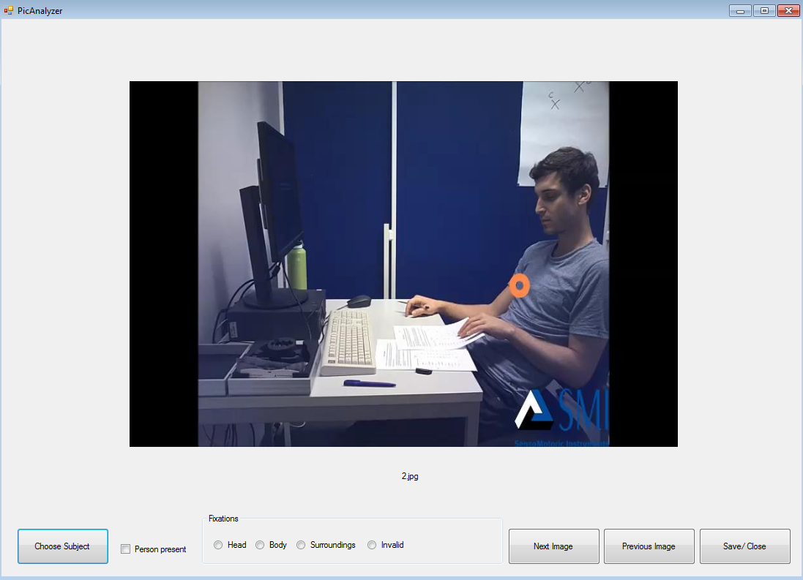

<h1 align="center">framecoder</h1>

<a href="https://ci.appveyor.com/project/vankesteren/framecoder/branch/master">
</img>
</a>

The framecoder was built using Visual Studio to facilitate the coding of fixated Regions Of Interest (ROIs) during mobile eye tracking experiments. The current implementation is applicable for four mutually exclusive ROIs – head, body, surroundings, invalid fixation. Additionally, it contains a checkbox indicating whether a person is present in the picture. The numbers of buttons and checkboxes can be easily adjusted and names can be replaced in the corresponding code. 

## Installing framecoder
The most recently built `.exe` (experimental!) can be found on [AppVeyor](https://ci.appveyor.com/project/vankesteren/framecoder/build/artifacts).

 

## Data format

In order to be able to adequately use the framecoder, the videos need to be already split into their respective frames. The application was programmed in such a way that the name of the overarching folder containing all the frame pictures will be used for the designation of the output file name and all entries of its first column. The length can accordingly be adjusted in the software code (currently set to two characters).

 

## How to use

The button names of the framecoder explain most of its functions. Via  `file > open subject` all images that are to be coded of the specific participant can be loaded into the Analyzer (here ctrl + alt is usually the best way to go). The radio buttons and checkboxes can consequently be used to code which areas of the image were looked at by the participant. The checkbox will remain checked across frames unless it is unchecked. Similarly,  the chosen radio button (head, body, surroundings or invalid fixation) will remain selected. If the corresponding ROI was indeed still fixated, the “Next Image” can be used to load the next image. If a different radio button is chosen, the next image will  automatically be loaded, saving a click. Checking or unchecking the checkbox does not trigger the next image to appear. If a wrong ROI was accidentally selected the “Previous Image” button can be clicked and the button coding the frame can be selected anew. The “Save/Close”-Button can be used to save and close the app. It will automatically trigger a saving and close when all of the loaded images were coded. The framecoder yields a csv-file saving participant name, image name, and the chosen buttons (indicated by 1, all other buttons are coded 0) for each frame which can be used for further analyses. Click <a href="https://github.com/lara-roe/MobileEye/blob/master/01.csv">here</a> for an example output file.

## Building framecoder from source
- Install Visual Studio 2017 (later versions probably work too!)
- Clone / download this repository
- Open `/framecoder/framecoder.csproj`
- Build the project using Visual Studio
- The `.exe` will be generated in the `/framecoder/bin/` folder.