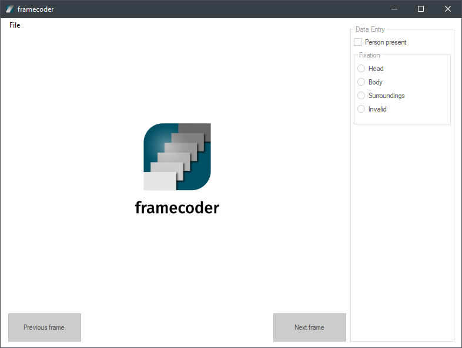

<h1 align="center">framecoder</h1>

<a href="https://ci.appveyor.com/project/vankesteren/framecoder/branch/master">
</img>
</a>

Framecoder is an open source application for Windows enabling fast manual coding of video frames, for example for labeling Regions Of Interest (ROIs) during mobile eye tracking experiments.

## Installing framecoder
The most recently built version of framecoder (experimental!) can be found on [AppVeyor](https://ci.appveyor.com/project/vankesteren/framecoder/build/artifacts). Download it, unzip to a nice location, and run `framecoder.exe`.

</img>

## Input format
Input videos need to be already split into their respective frames, and each video needs to have its own folder. Video splitting support is in development. 

Via  `file > open subject folder` all images that are to be coded for a specific video can be loaded into the session. 

## Coding frames
The radio buttons and checkboxes can be used to code the frames. For quick usage, each data entry control is associated with a shortcut key (1-5). For example, pressing the `1` key on the keyboard will toggle the first checkbox. The next and previous frames can be selected using the right and left arrow keys.

#### Advanced: Custom coding
By editing the text file `assets/config.yaml` in the framecoder folder before startup, custom data entry controls can be added to the data entry fields. Only checkboxes, radiobuttons, and text fields are supported. The shortcuts can also be edited here.

## Output format
Under `file > Export .csv` a semicolon-separated data file with all the codings can be exported to the disk. The data file will look somewhat like so:

</img>

Additionally, an entire session can be saved and loaded using `file > Save session` and `file > Load session`, so you can save your work and continue where you left off.

## Building framecoder from source
Framecoder is written in `C#` using `.NET`. Dependencies are managed via `NuGet`.
- Install Visual Studio 2017 (later versions probably work too!)
- Clone / download this repository
- Open `/framecoder/framecoder.csproj`
- Build the project using Visual Studio
- The `.exe` will be generated in the `/framecoder/bin/` folder.